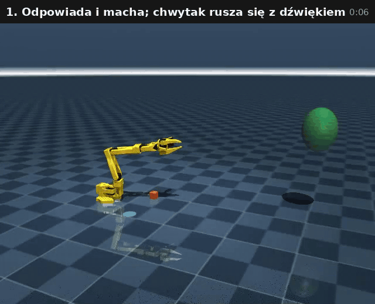
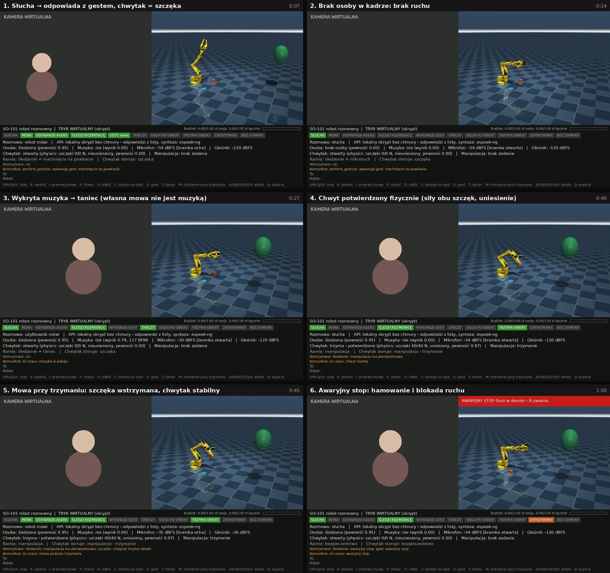

# SO_101_expressive — ekspresyjny robot rozmowny na ramieniu SO-101

Prototyp robota, który rozmawia po polsku przez mikrofon i głośniki MacBooka, patrzy na rozmówcę
(kamera laptopa) i reaguje ruchem całego ramienia SO-101 w symulacji MuJoCo: śledzi osobę,
gestykuluje, tańczy do muzyki, porusza chwytakiem jak „szczęką” w rytm **faktycznie odtwarzanego**
dźwięku, a także naprawdę (w fizyce) chwyta, podnosi i odkłada kostkę. Inspiracją jest Reachy Mini,
ale ekspresja jest dopasowana do mechaniki SO-101: ramię z chwytakiem, bez osobnej głowy i szczęki.

Projekt jest osobnym folderem, przeznaczonym do położenia **obok** istniejącego `SO_101_arm`.
Nie modyfikuje go i z nim nie łączy (szczegóły niżej).

## Szybki start (jedna komenda)

```bash
cd SO_101_expressive
./start.sh              # kamera + mikrofon + głośniki + okno z symulacją MuJoCo
```

Pierwsze uruchomienie tworzy `.venv`, instaluje zależności i kopiuje `.env.example` do `.env`.
Bez klucza API robot działa w **trybie lokalnym** (przygotowane odpowiedzi, polski głos systemowy
macOS „Zosia”). Aby włączyć prawdziwą rozmowę, wpisz klucz z Google AI Studio w `.env`:

```
GEMINI_API_KEY=...        # tylko w lokalnym pliku .env; nigdy w kodzie ani w repozytorium
```

Inne tryby tej samej komendy:

| Komenda | Co robi |
|---|---|
| `./start.sh --check` | autodiagnostyka: Python, MuJoCo, render, YuNet, **kamera**, **audio**, klucz (bez ujawniania), budżet |
| `./start.sh --api-smoke` | jedna krótka tura z prawdziwym `gemini-3.8-live` (koszt rzędu ułamka grosza) — sprawdza klucz, model i dźwięk |
| `./start.sh --virtual` | demo bez urządzeń: skryptowany rozmówca, mowa i muzyka; ta sama logika robota |
| `./start.sh --virtual --headless --record demo.mp4` | to samo bez okna, zapis do wideo H.264 **z dźwiękiem** (mowa robota, rozmówca, muzyka), jeśli jest `ffmpeg` (`brew install ffmpeg`); obok powstaje `demo.wav`. Bez ffmpeg zostaje wideo mp4v bez dźwięku |
| `./start.sh --no-camera` / `--no-audio` | wyłącza wybrane urządzenie |

Wymagania: macOS (projekt był pisany pod MacBooka M1 Max), Python 3.10+ albo `uv`
(`brew install uv` — skrypt sam pobierze Pythona 3.12). Przy pierwszym starcie macOS zapyta
o dostęp do **kamery** i **mikrofonu** dla aplikacji terminala — trzeba się zgodzić
(Ustawienia systemowe → Prywatność i ochrona → Kamera / Mikrofon).

## Podgląd dema

Nagrania z trybu wirtualnego (symulacja, skryptowany rozmówca, polska mowa z espeak-ng):



- [`docs/media/demo_virtual.mp4`](docs/media/demo_virtual.mp4) — pełne 66 s, 1280×720, H.264 z dźwiękiem
  (pobierz i odtwórz lokalnie); słychać, że chwytak-szczęka porusza się razem z głosem robota,
  a przy trzymaniu kostki stoi;
- [`docs/media/demo_highlights.gif`](docs/media/demo_highlights.gif) — 22 s najważniejszych momentów (powyżej);
- [`docs/media/demo_storyboard.jpg`](docs/media/demo_storyboard.jpg) — sześć kluczowych kadrów z paskiem stanu (poniżej).



## Obsługa

Okno ma trzy części: podgląd kamery z ramką twarzy (lewa), symulację (prawa) i pasek stanu (dół).

| Klawisz | Działanie |
|---|---|
| `SPACJA` / `E` | **awaryjny stop** (zatrzaskiwany; robot hamuje i stoi, chwytak nie puszcza obiektu) |
| `R` | zwolnienie awaryjnego stopu |
| `I` | przerwij mowę robota |
| `P` / `O` / `C` | chwyć kostkę / odłóż na niebieskie pole / kostka z powrotem na start |
| `G` / `T` | kolejny gest / krótki taniec |
| `M` | przełącz opcję „milczenie podczas trzymania obiektu” |
| `A` `D` `W` `S` `Z` `X` `V`, mysz | obrót, przybliżenie i reset widoku symulacji |
| `Q` / `ESC` | wyjście |

Rozmowa: po prostu mów. Robot może sam wywołać gest, taniec, podniesienie lub odłożenie kostki
(„podnieś kostkę”), sprawdzić swój stan („co teraz robisz?”) albo spojrzeć przez kamerę („co widzisz?”).

**Prywatność kamery:** obraz jest analizowany lokalnie (śledzenie twarzy). Do chmury trafia pojedyncza,
pomniejszona klatka tylko wtedy, gdy jednocześnie:

1. model poprosi o spojrzenie;
2. Twoja wypowiedź, rozpoznana przez transkrypcję w ostatnich 20 s (`CAMERA_REQUEST_WINDOW_S`), wprost
   prosi o spojrzenie — np. „co widzisz?”, „spójrz”, „popatrz”, „pokażę ci…”, „jak wyglądam?”;
3. lokalny detektor mowy usłyszał Cię w tym czasie.

Jedna taka wypowiedź odblokowuje najwyżej jedną klatkę. Transkrypcja przychodzi bez gwarancji kolejności,
więc prośba modelu czeka na rozpoznanie wypowiedzi najwyżej 3 s; znika po odmowie, anulowaniu lub rozłączeniu.
Sama muzyka czy hałas niczego nie odblokują. Wymaga to włączonej transkrypcji (`LIVE_TRANSCRIPTS`, domyślnie
włączona). Licznik wysłanych klatek widać na pasku stanu, a `CAMERA_CLOUD=off` całkowicie wyłącza wysyłanie
obrazu. Cykliczne wysyłanie klatek (bogatszy kontekst rozmowy, wyższy koszt) włączysz w `.env`,
np. `VISION_UPLINK_INTERVAL_S=12` — wtedy klatki idą w tle niezależnie od powyższych warunków.

Pasek stanu pokazuje czynności robota (słucha, mówi, odtwarza audio, śledzi rozmówcę, wykonuje gest,
tańczy, sięga po obiekt, trzyma obiekt, zatrzymany, bez chmury), fazę chwytu ze źródłem pomiaru,
kto steruje ramieniem i chwytakiem, co jest **wstrzymane i dlaczego**, poziomy mikrofonu i głośnika,
wynik detektora muzyki oraz zużycie budżetu.

## Jak robot podejmuje decyzje

Model językowy **nie wysyła pozycji ani prędkości serw**. Może tylko poprosić o czynność z zamkniętej
listy (wyłącznie wartości wyliczeniowe). Planista sprawdza stan, a arbiter składa warstwy według
pierwszeństwa:

1. **awaryjny stop i limity ruchu** — bezpieczny sterownik: zakresy przegubów z marginesem, limity
   prędkości i przyspieszenia, odrzucanie wartości NaN, prześwit nad blatem;
2. **utrzymanie obiektu** — od komendy chwytu do potwierdzonego zwolnienia chwytak nie reaguje na mowę;
3. **cel manipulacyjny** — zadanie chwytu przejmuje całe ramię;
4. **śledzenie rozmówcy** — obrót podstawy i pochylenie chwytaka jako „wzrok”; przy niepewnej
   detekcji lub braku osoby ruch jest zamrażany;
5. **gesty ekspresyjne i taniec** — przesunięcia o gładkim profilu, wygaszane przy przerwaniu;
6. **szczęka** — chwytak śledzi obwiednię dźwięku w chwili wyjścia z głośnika.

Stan chwytu rozróżnia **komendę** (`komenda chwytu wydana`), **kontakt** (obie szczęki naciskają
obiekt, chwytak zablokowany) i **potwierdzenie** (obiekt uniesiony i jedzie z chwytakiem). W symulacji
źródłem są siły kontaktu z fizyki MuJoCo (`physics`). Pozorowany stan do testów logiki ma źródło
`mock` i jest oznaczony na panelu jako „POZOROWANY STAN TESTOWY”.

## Koszty i budżet

Domyślnie: **5 zł na sesję** i **130 zł łącznie** (`BUDGET_SESSION_PLN`, `BUDGET_TOTAL_PLN`).
Licznik bierze większą z dwóch wartości: kosztu z metadanych zużycia zwracanych przez serwer
i ostrożnego szacunku lokalnego (czas nasłuchu, audio wyjściowe, klatki obrazu, transkrypcje oraz
**ponowne naliczanie kontekstu w każdej turze**, bo tak rozlicza się Live API). Wynik mnoży przez
`COST_SAFETY_FACTOR` (1,25). Po przekroczeniu limitu sesja jest zamykana, mikrofon przestaje być
wysyłany i nie ma ponownych połączeń. Robot działa dalej lokalnie (śledzi, tańczy, reaguje na klawisze).
Łączne wydatki są zapisywane w `runtime/usage_ledger.json`, a surowe metadane zużycia w
`runtime/logs/gemini_usage.jsonl`.

To są **szacunki, nie gwarancja rachunku**. Po pierwszej sesji porównaj licznik z panelem
rozliczeń AI Studio i w razie potrzeby popraw `COST_SAFETY_FACTOR` oraz `USD_TO_PLN`
(domyślne 3,65 to założenie, nie pobrany kurs). Szacunek kosztu minuty rozmowy i porównanie
wariantów są w [`docs/PLAN.md`](docs/PLAN.md).

Oszczędzanie: `IDLE_DISCONNECT_S` rozłącza sesję, gdy nikogo nie ma i nikt nie mówi.
W `gemini-3.8-live` proactive audio jest zawsze włączone i Google nalicza wejście przez cały czas
nasłuchu. Niższe `CONTEXT_TRIGGER_TOKENS` obniża koszt tury, a `MIC_STREAM_MODE=vad` wysyła tylko fragmenty z mową.

## Ważne: echo przy głośnikach laptopa

Oficjalne przykłady Live API zalecają słuchawki, bo bez usuwania echa model słyszy sam siebie
i przerywa własną wypowiedź. Brief zakłada wbudowane głośniki, dlatego mikrofon jest **bramkowany
przez całą turę robota** (`ECHO_MODE=half_duplex`). Aby wejść robotowi w słowo, trzeba mówić
wyraźnie głośniej od jego głosu (`BARGE_IN_RATIO`) albo nacisnąć `I`. Działanie bramki zweryfikowano
w symulowanym echu. **Na prawdziwym MacBooku trzeba je dostroić.** Przy słuchawkach ustaw `ECHO_MODE=off`.

## Testy

```bash
.venv/bin/python -m pytest -q                      # 96 testów, ok. 30 s
.venv/bin/python scripts/fetch_test_data.py --audio   # opcjonalne dane: portret (domena publiczna) i nagrania CC
.venv/bin/python scripts/eval_music_detector.py --music utwór.mp3 --other mowa.wav
```

Testy obejmują siedem scenariuszy z briefu (rozmowa z gestem, przerwanie, zniknięcie i powrót
rozmówcy, muzyka i taniec, chwyt podczas mówienia, utrata sieci / błąd API / budżet, awaryjny stop
i limity) oraz testy jednostkowe warstw. Rozmowę z Gemini testuje fałszywy serwer zbudowany na
prawdziwych typach SDK `google-genai`. Wyniki weryfikacji są opisane w `docs/PLAN.md`.

## Związek z `SO_101_arm`

Projekt powstał w chmurowym sandboksie **bez dostępu do Twojego laptopa**, więc folderu `SO_101_arm`
nie widziałem. Zamiast jego modelu użyty jest oficjalny model SO-101 z MuJoCo Menagerie
(pochodna `so101_new_calib.xml` TheRobotStudio, z kolizjami chwytaka dobranymi do manipulacji).
Model z `SO_101_arm` możesz wskazać w `.env` (`MJCF_PATH=../SO_101_arm/.../so101_new_calib.xml`).
Scena jest doklejana w kodzie, więc plik źródłowy pozostaje nietknięty. Nazwy przegubów muszą być
standardowe (`shoulder_pan` … `gripper`).

## Struktura

```
src/so101_expressive/
  inputs/        kamera, YuNet i śledzenie twarzy, mikrofon, VAD, bramka echa, detektor muzyki, bufor odtwarzania
  conversation/  interfejs ConversationBackend, Gemini Live, lokalny skrypt, narzędzia, prompt
  behavior/      gesty i taniec, szczęka, śledzenie, manipulacja, arbiter, planista
  motion/        limity, bezpieczny sterownik, kinematyka (IK)
  sim/           adapter MuJoCo i renderer
  state.py       obserwowalny stan robota i dziennik przejść
  budget.py      licznik kosztów, rejestr i limity
  runtime.py     pętla ciała (100 Hz)       app.py  okablowanie trybów     ui.py  panel
```

Licencje zasobów: [`assets/README.md`](assets/README.md) (model SO-101 Apache-2.0, YuNet MIT).
